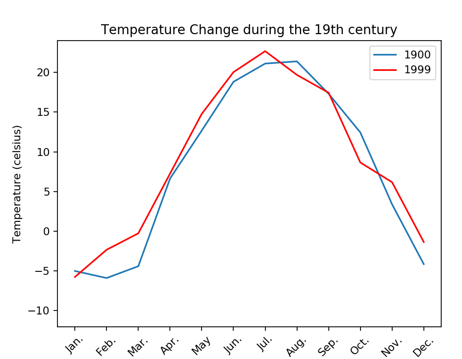
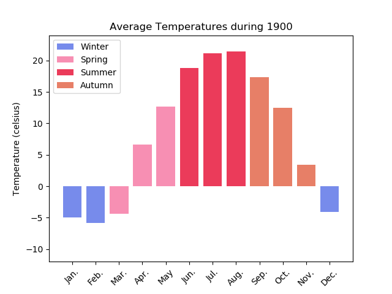

# Applied-Plotting-Charting-Data-Representation-in-Python-Project
This is part of Applied Plotting, Charting &amp; Data Representation in Python Course from the University of Michigan that I enrolled on. I was asked to state a climate phenomenon, find an accessible dataset and create a visual using matplotlib that addresses my stated phenomenon.

### What am I trying to do?
the world is getting warmer, and I decided to estimate that change by comparing the observed temperatures from 1900 to 1999 in New York City.

### Data Collection
As we know that In any data science problem, the starting point of anything is data.

I searched a lot to find a suitable dataset that contains historical temperature data. I found 
[Climate Change: Earth Surface Temperature Data](https://www.kaggle.com/berkeleyearth/climate-change-earth-surface-temperature-data#GlobalTemperatures.csv) and was the perfect choice because it contains historical data starting from 1750 for a lot of countries and cities

I was interested in New York especially during the 19th century so I dropped unnecessary cols or rows 

### Data visualization
Too quick understanding the data and the Temperatures change, A-line plot was made to see the difference between the starting and ending year of our data

An animated bar plot was made to see in details how temperatures change

### Conclusion

We can see that the temperatures were increased especially in the spring and summer
